

# A N I L O V E

**DISCOVER · WATCH · KEEP YOUR PLACE**

An anime companion for Android.

**Current version: v6.1.22**

 

  

<a href="https://updater-servers-production.up.railway.app/api/app-update/download"><strong>Download latest APK</strong></a>
&nbsp; · &nbsp;
<a href="CHANGELOG.md">Changelog</a>
&nbsp; · &nbsp;
<a href="https://www.anilove.bond">Website</a>
&nbsp; · &nbsp;
<a href="https://www.anilove.bond/privacy-policy">Privacy</a>

---

## The Anilove experience

Anilove helps you discover anime, save shows to your watchlist, and keep track of episodes in one Android app.

## Screenshots

<table>
  <tr>
    <td align="center">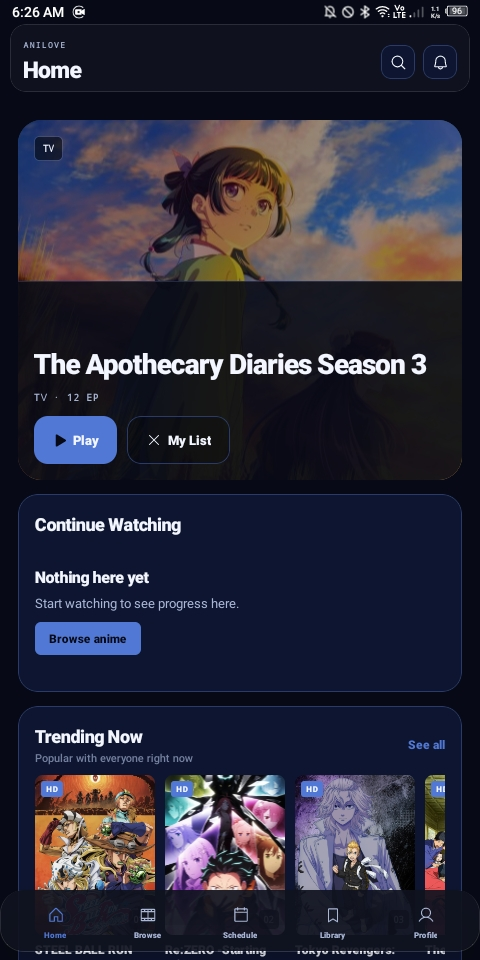 Home</td>
    <td align="center">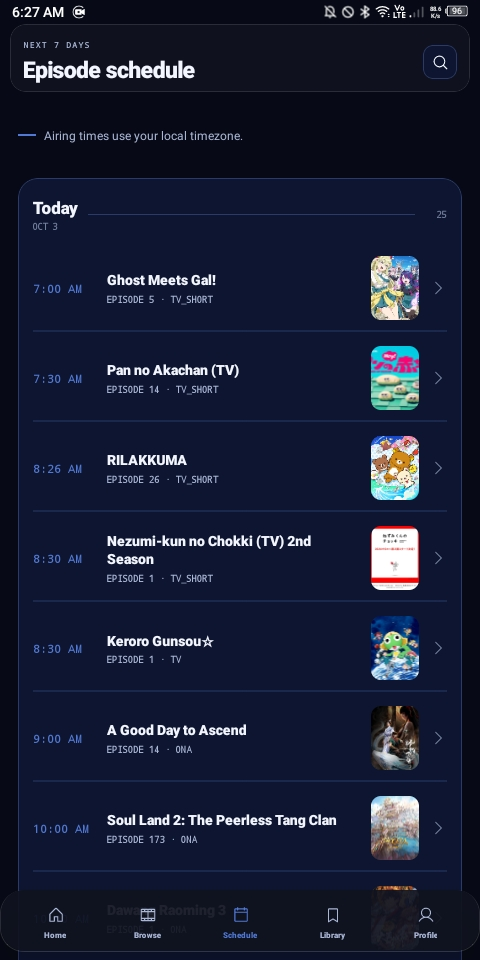 Schedule</td>
    <td align="center">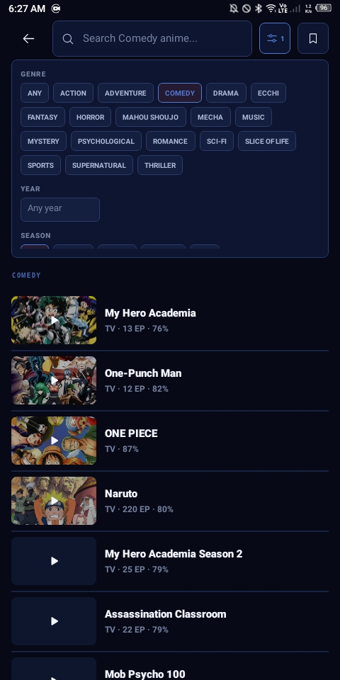 Browse and filters</td>
  </tr>
  <tr>
    <td align="center">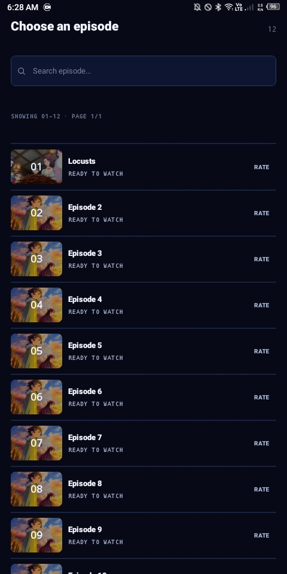 Epidode list</td>
    <td align="center">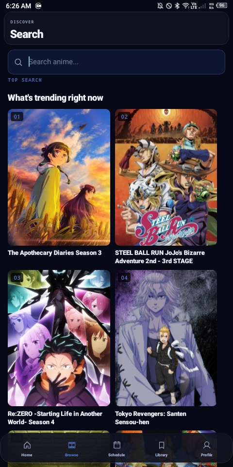 Search</td>
    <td align="center">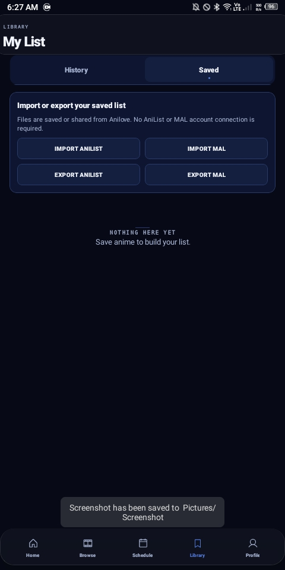 Saved list</td>
  </tr>
  <tr>
    <td align="center">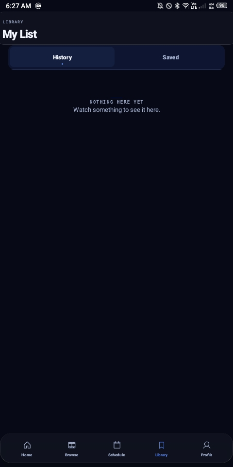 Watch history</td>
    <td align="center">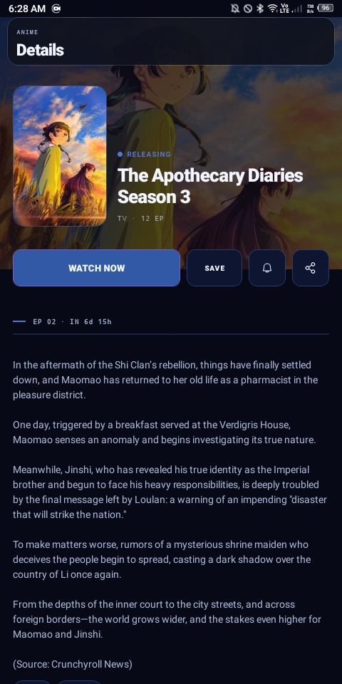 Anime details</td>
    <td align="center">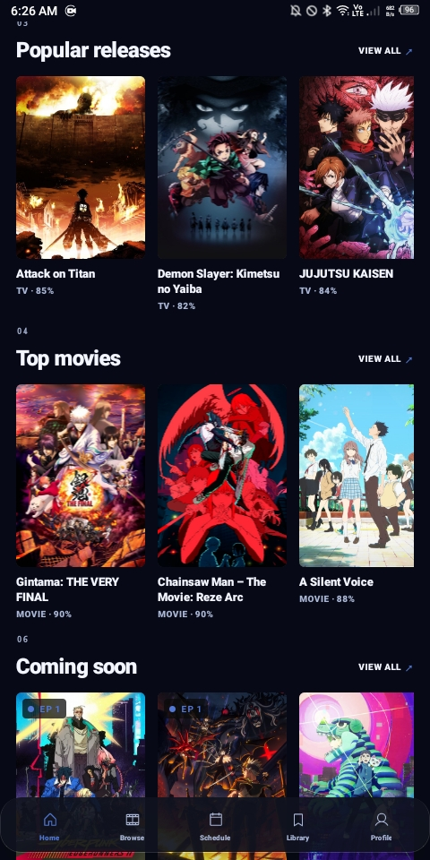 Discover</td>
  </tr>
  <tr>
    <td align="center">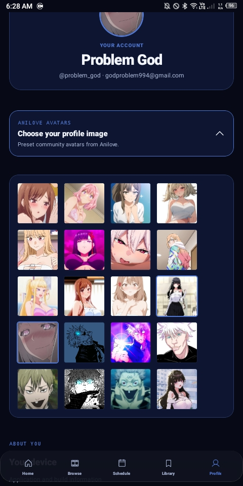 profiles</td>
    <td align="center">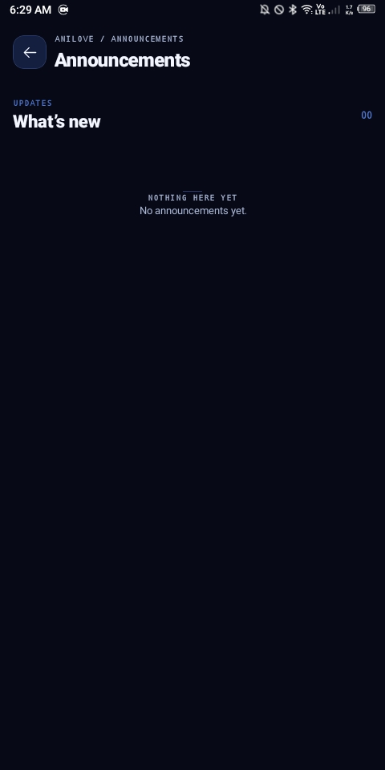 Announcements</td>
    <td></td>
  </tr>
</table>

## Features

- Browse anime titles and show details
- Save shows to your watchlist
- Keep track of watch history and episode progress
- Adjust playback and subtitle preferences
- Android 9 and newer

## Download and install

The **[Download latest APK](https://updater-servers-production.up.railway.app/api/app-update/download)** button downloads the current Android installer from the Anilove update service. On Android, open the downloaded APK and follow the installation prompt. If prompted, allow your browser or file manager to install unknown apps.

Android only installs an update over an existing app when the package name and signing certificate match. If Android reports a signature conflict, don't uninstall first if you need to preserve local app data; contact support for help.

### VirusTotal scan

The linked VirusTotal report is associated with the v6.1.21 APK (SHA-256: `ded4cee7a90e96c7d04f5b7e6ad5403b79f4deafa17c5e87f1149b2ab02b1811`). VirusTotal results can change as antivirus engines update their signatures. The linked report is the source of truth for the scan associated with that release.

[View VirusTotal scan →](https://www.virustotal.com/gui/file/ded4cee7a90e96c7d04f5b7e6ad5403b79f4deafa17c5e87f1149b2ab02b1811?nocache=1)

## Releases and source code

This repository contains the Anilove app page and documentation, not the Android app source or APK binaries. APK downloads are served by the Railway update API. Keep app source code and APK files out of this repository.

## Links

- [Anilove website](https://www.anilove.bond)
- [Privacy policy](https://www.anilove.bond/privacy-policy)
- [Terms of use](https://www.anilove.bond/terms)
- [Legal](https://www.anilove.bond/legal)
- [Contact support](mailto:supportaniloveapp@gmail.com)

---

### ANILOVE

**Find a show. Keep your place.**

 

<a href="https://updater-servers-production.up.railway.app/api/app-update/download"><strong>GET THE LATEST APK →</strong></a>

